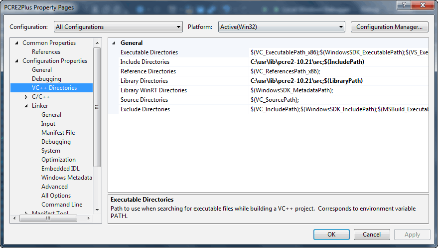
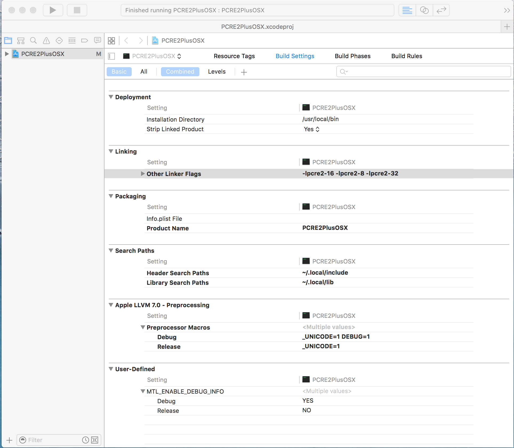
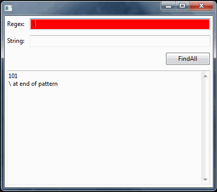
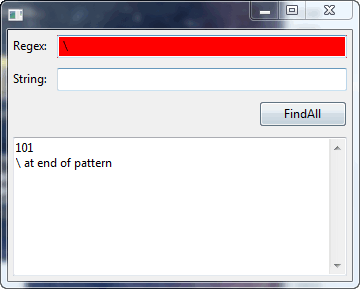
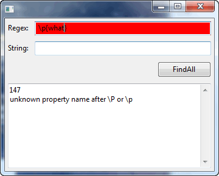
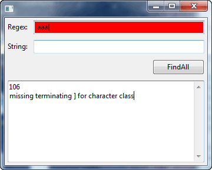
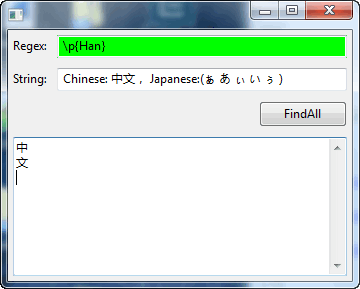
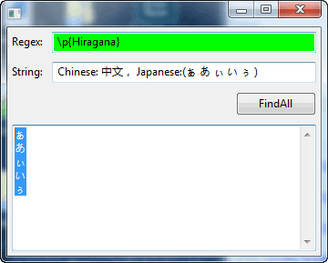

#PCRE2 Plus

##Recent Change

I. Build option -DHEAP_MATCH_RECURSE=1 add in win32 build bat file to avoid stack overflow issue in long string. No suggestion to change on Linux build script yet(will be done later)


II. No longer allows to put string directly to search function as PCRE2Plus was facing a performance issue in finditer function, in the past we copy string in each search function which is really slow, no we use string reference. This is the same behavior as std::regex

For Example:

Following code will fail, you may got compiler error:
error C2280: 'std::vector<std::string,std::allocator<_Ty>> PCRE2Plus::re::findall(const std::string &,const std::string &&,size_t,int)' : attempting to reference a deleted function

```c++

    std::string STR = "abc def hig";
    auto v = re::findall(R"(.+)", STR);

```

The code **must** be changed to following

```c++

    std::string STR = "abc def hig";
    auto v = re::findall(R"(.+)", STR);

```


##Description

A Python style regular expression wrapper for PCRE2 (pcre project [http://www.pcre.org/](http://www.pcre.org/)), using C++ 11 standard.

Unicode and wide string friendly.

The *motivation* for making this project is to adapt the powerful PCRE2 utility to C++ followed by Python standard, so the user don't need to remember the details of c style regexp functions provide by PCRE2 as long as he/she can write regexp function in Python style.


##Installation 

###Install PCRE2
Homepage and Download: [http://www.pcre.org/](http://www.pcre.org/)

**Minimal PCRE2 version required: pcre2-10.21**

Alternately, pcre2-10.21 is cached in this repo: [pcre-2-10.21.zip](3PP/pcre2-10.21.zip)


###Install on Windows (VC++)

Download build bat file from this repo: 
[build_pcre2_10.21.bat](3PP/build_pcre2_10.21.bat) 

    1. Extract pcre2-10.21.zip
    2. Place the build bat file in the source
    2. Start VC++ command line
    3. Go the directory of pcre2 source
    4. Execute build bat
    5. If everything OK, you'll get six lib files: libpcre2-8.lib libpcre2-16.lib libpcre2-32.lib libpcre2-8d.lib libpcre2-16d.lib libpcre2-32d.lib 

###Install on *Nix (VC++)

    1. Extract pcre2-10.21.zip
    2. Go to pcre2 source directory
    2. ./configuere --enable-pcre2-16 --enable-pcre2-32
    3. make && make install 
    
**make sure 16 and 32 bit character support are supported besides 8 bit**

##Usage

Put PCRE2 source directory to C++ project include and library

Put PCRE2 lib files to project linker parameter (all 8, 16 and 32 bit)

### Add PCRE2 to VC++
Presume the pcre2 is installed to c:\usr\lib\pcre2-10.21


With macro supported, it's possible for VS C++ to choose correct lib. (Do not specify lib name in "link/input" dialog.

### Add PCRE2 to Xcode
Presume the pcre2 is installed to ~/.local



### Add PCRE2Plus to Project

Include [PCRE2Plus.h](PCRE2Plus/PCRE2Plus.h) in Project

Add [PCRE2Plus.cpp](PCRE2Plus/PCRE2Plus.cpp) to Project

```c++

    #include "PCRE2Plus.h"
    using namespace PCRE2Plus;
    std::string c = R"(\w+)";
    auto Regex = re::compile(c);
    if (Regex){
        std::cout<<"OK"<<std::endl;
        std::string STR = "abc";
        auto M = Regex->search(STR);
        if (M){
            std::cout<<(M->group())<<std::endl;
        }
    }
    else{
        std::cout<<"NOK"<<std::endl;
        std::cout<<re::getlasterror()<<std::endl;
        std::cout<<re::getlasterrorstr()<<std::endl;
    }

```

##Syntax

###Cache handling
There is a cache mechanism in the module now.

when then cache is enabled (**re::usecache = true;**) following function will cache the regex object:

    re::search, 
    re::split
    re::findall
    re::finditer
    re::sub
    re::subn

In this case you don't necessary to generated a re object in loops:
e.g 

Before:

    std::vector<std::string> Lines;
    Lines = ... //pushing some data
    for (const auto & i : Lines){
        if (re::search("blabla", i)){
            //Do something
        }
    }

is slow than

    std::vector<std::string> Lines;
    auto R = re::compile("blabla");
    Lines = ... //pushing some data
    for (const auto & i : Lines){
        if (R->search("blabla", i)){
            //Do something
        }
    }

After using Cache:

    re::usecache = true;

The performance shall be very close.

Other cache functions:

    re::getcachesize() // Get Cache Count

    re::purgecache()  // Purge Cache

**NOTE**

Cache is not enabled by default.

###Python like Syntax

Python re syntax document: [https://docs.python.org/2/library/re.html](https://docs.python.org/2/library/re.html)

BASELINE: 2.7.11

[State of compliance for python re document](SOC.md)

###Unicode Support

Unicode are support by PCRE2

Make sure 16 bit(for VC++) or 32 bit (for *nix/Mac) are linked to the project.

All Unicode Chars shall be processed by wide string(std::wstring, begins with "L" indicator).

And make sure, once the wide string is used for strings, pattern and repl **MUST** be wide string also.

    There are two kinds of objects: ObjFoo and ObjFooW, the latter one is for wide string. 
    
    Every logical code has two copys, one for ANSI and the other for wide string.

    Users shall not aware of the difference as they can use keyword auto to take the object(smart pointer) returned from compile or search functions. 
    
    Of course, user shall use std::string or std::wstring in the last phase based on they input string type.


Example of matching Chinese chars (wide string)

```c++

    std::wstring STR =  L"赵 钱 孙 李";
    auto v = re::findall(LR"(\p{Han})",STR);
    for (auto i = v.begin(); i < v.end();i++){
        std::wcout<<(*i)<<std::endl;
    }

    //赵
    //钱
    //孙
    //李
    
```

Reference of Unicode Category:

[http://www.regular-expressions.info/unicode.html](http://www.regular-expressions.info/unicode.html)

##Exception Handling

There is no exception handling

nullptr or empty string or empty vector will be returned if anything goes wrong

Use following function for regexp compilation error or sub/subn function

```c++

    re::getlasterror()  // != 100 for abnormal cases

    re::getlasterrorstr()

    re::geterroroffset()

```

Examples:
There is a wxwidgets based regex test project in repo

[src](PCRE2PlusTest)

[Binary](PCRE2PlusTest/Binary.zip)

Here are some examples

Snippet

```C++

        m_textCtrlRegex->Bind(wxEVT_TEXT, [=](wxCommandEvent &event){
            std::wstring a = m_textCtrlRegex->GetValue();
            auto R = re::compile(a);
            if (R){
                m_textCtrlRegex->SetBackgroundColour(wxColor(0,255,0));
                m_textCtrlRegex->Refresh();
                m_textCtrlFindAll->Clear();
                m_textCtrlFindAll->Refresh();
            }
            else{
                m_textCtrlRegex->SetBackgroundColour(wxColor(255, 0, 0));
                m_textCtrlRegex->Refresh();
                m_textCtrlFindAll->Clear();
                m_textCtrlFindAll->AppendText(std::to_string(re::getlasterror()));
                m_textCtrlFindAll->AppendText("\n");
                m_textCtrlFindAll->AppendText(re::getlasterrorstr());
                m_textCtrlFindAll->Refresh();
            }
        }

```














**No error** shall be trigged during the RegexObj.search function

For details see [State of compliance for python re document](SOC.md) document

##Known Issues
The current phase of this project is to support basic function and handle unicode texts properly

some functions related to the position are not fully tested(although a few other functions are depend on them and works)

Function call in re.sub is not supported

##Developer
API: [http://www.pcre.org/current/doc/html/pcre2api.html](http://www.pcre.org/current/doc/html/pcre2api.html)

Coding style for PCRE2Plus:

tab => 4 spaces

Unix Line ending

## License

**BSD**

>    Copyright (c) 2016, Boying Xu
>    All rights reserved.

>    Redistribution and use in source and binary forms, with or without modification, are permitted provided that the following conditions are met:

>    1. Redistributions of source code must retain the above copyright notice, this list of conditions and the following disclaimer.

>    2. Redistributions in binary form must reproduce the above copyright notice, this list of conditions and the following disclaimer in the documentation and/or other materials provided with the distribution.

>    3. Neither the name of the copyright holder nor the names of its contributors may be used to endorse or promote products derived from this software without specific prior written permission.

>    THIS SOFTWARE IS PROVIDED BY THE COPYRIGHT HOLDERS AND CONTRIBUTORS "AS IS" AND ANY EXPRESS OR IMPLIED WARRANTIES, INCLUDING, BUT NOT LIMITED TO, THE IMPLIED WARRANTIES OF MERCHANTABILITY AND FITNESS FOR A PARTICULAR PURPOSE ARE DISCLAIMED. IN NO EVENT SHALL THE COPYRIGHT HOLDER OR CONTRIBUTORS BE LIABLE FOR ANY DIRECT, INDIRECT, INCIDENTAL, SPECIAL, EXEMPLARY, OR CONSEQUENTIAL DAMAGES (INCLUDING, BUT NOT LIMITED TO, PROCUREMENT OF SUB
>    STITUTE GOODS OR SERVICES; LOSS OF USE, DATA, OR PROFITS; OR BUSINESS INTERRUPTION) HOWEVER CAUSED AND ON ANY THEORY OF LIABILITY, WHETHER IN CONTRACT, STRICT LIABILITY, OR TORT (INCLUDING NEGLIGENCE OR OTHERWISE) ARISING IN ANY WAY OUT OF THE USE OF THIS SOFTWARE, EVEN IF ADVISED OF THE POSSIBILITY OF SUCH DAMAGE.
